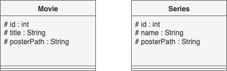
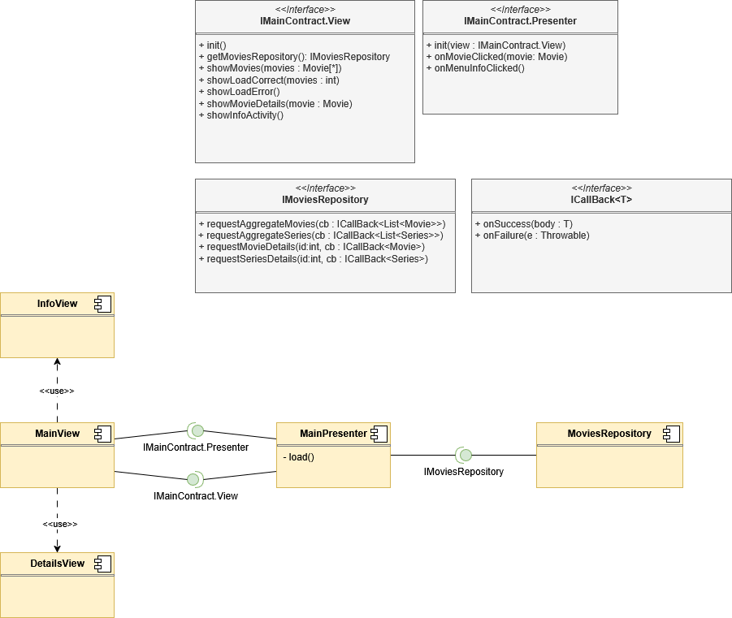

## Modelos del Proyecto

En este directorio encontrarás los diagramas principales del modelo de la aplicación:

### Diagramas

#### Dominio

#### Arquitectura

### Cómo editar y exportar los diagramas

1. Abre el archivo correspondiente (`domain.drawio` o `architecture.drawio`) en [draw.io](https://app.diagrams.net/).
    - **File > Open from device**
2. Realiza las modificaciones necesarias en el editor.
3. Exporta el diagrama a formato PNG:
    - **File > Export as > PNG**.
4. Guarda el PNG en este mismo directorio con el nombre adecuado (`domain.png` o `architecture.png`).

Así mantendrás actualizados los diagramas visuales del proyecto.
