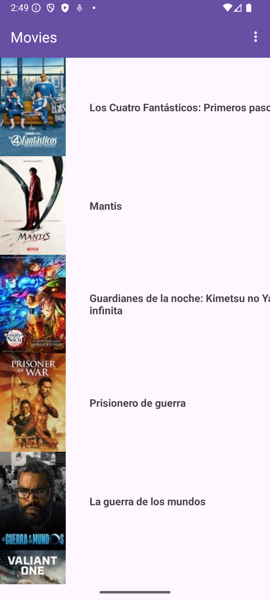

# Proyecto Base 2025 - Películas

Este repositorio contiene el código inicial para el Proyecto Integrado 2025.

La información relativa al Proyecto Integrado, y las asignaturas que lo componen, se puede encontrar en la [Wiki](https://github.com/isunican/docsProyectoIntegrado/wiki).

La aplicación inicial incluye funcionalidad básica para descargar y mostrar información sobre películas y series, utilizando el servicio REST oficial de [TMDB](https://developer.themoviedb.org/reference/intro/getting-started).

Información sobre este servicio REST y los datos suministrados puede encontrarse en la [documentación oficial de TMDB](https://developer.themoviedb.org/reference/intro/getting-started).

La aplicación utiliza el patrón Model-View-Presenter. Información detallada sobre la arquitectura y el modelo puede consultarse [aquí](Docs/Models/README.md).

El análisis de calidad del código se realiza con SonarQube y está disponible en [este enlace](https://sonarcloud.io/project/overview?id=App-Movies-Grupo3).

El archivo JSON por defecto utilizado para los datos de películas es  
[https://personales.unican.es/rivasjm/resources/tmdb/movies/aggregate.json](https://personales.unican.es/rivasjm/resources/tmdb/movies/aggregate.json),  
que se actualiza periódicamente.

El archivo JSON por defecto utilizado para los datos de series es  
[https://personales.unican.es/rivasjm/resources/tmdb/series/aggregate.json](https://personales.unican.es/rivasjm/resources/tmdb/series/aggregate.json),  
que también se actualiza periódicamente.

La versión inicial de la aplicación proporciona la siguiente interfaz de usuario:

  

